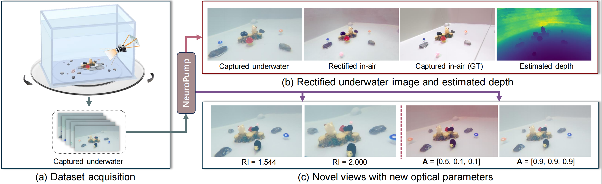

# NeuroPump: Simultaneous Geometric and Color Rectification for Underwater Images

<p align="center">
  
</p>

Please watch the ACM MM'25 MPV in our [project-page][4] for a quick introduction of our work.

---
## Introduction

JAX's implementation of NeuroPump ([paper][1]). Based on Mip-NeRF 360 ([github][3]).

## Prerequisites

* JAX 0.3.23 compatible GPU with CUDA 11.8
* Conda (Python 3.9)
* jax 0.3.23
* jaxlib 0.3.22+cuda11.cudnn82
* torch 2.1.2+cu118
* torchvision 0.16.2+cu118
* Other packages are listed in [requirements.txt](requirements.txt).

## Usage

#### Reproduce paper results

1. Create a new conda environment:
   ```
   conda create --n pump python=3.9
   conda activate pump
   ```
2. Clone this repo:
   ```
   git clone https://github.com/YGswu/NeuroPump
   cd NeuroPump
   ```
3. Install required packages by typing
   ```
   pip install -r requirements.txt
   ```
4. Download NeuroPump [benchmark dataset (~ 800M)][1] and extract to `data/`
5. Train NeuroPump
   ```
   bash ./scripts/train_neuropump.sh
   ```
6. Test NeuroPump
   Render results:
   ```
   bash ./scripts/render_neuropump.sh
   ```
   Then, find results in your ckpt folder.
7. Render with new optic parameters. We provide 3 kinds of optic parameters: 
   ```
   bash ./scripts/render_neuropump_extension_change_s.sh
   bash ./scripts/render_neuropump_extension_change_refraction_index.sh
   bash ./scripts/render_neuropump_extension_change_background_light.sh
   ```
8. Calculate metrics. We also provide metrics calculation python file. Set right folder name before running.
   ```
   python ./img_process/estimate.py
   ```


---

## Citation

If you use the dataset or this code, please consider citing our work.
```
@inproceedings{guo2025neuropump,
  title     = {NeuroPump: Simultaneous Geometric and Color Rectification for Underwater Images},
  author    = {Guo, Yue and Liao, Haoxiang and Ling, Haibin and Huang, Bingyao},
  booktitle = {Proceedings of the 33rd ACM International Conference on Multimedia (MM ’25)},
  year      = {2025},
  publisher = {Association for Computing Machinery},
  address   = {Dublin, Ireland},
  doi       = {10.1145/3746027.3755303}
}
```


## Acknowledgments

- We developed our project based on Multi-NeRF ([github][3]) and Seathru-NeRF ([github][2]) repositories. We thank their clear and flexible coding style.
- We thank the anonymous reviewers for valuable and inspiring comments and suggestions.
- We thank the authors for their support and collaboration.
- Feel free to open an issue if you have any questions 😁.

## License

This project is freely available for non-profit non-commercial use, and may be redistributed under the conditions in [license](LICENSE).

[1]: https://drive.google.com/file/d/1PBMKolmDQgwf3UG0Nc6kkw8S1GmGEZJR/view?usp=sharing
[2]: https://github.com/deborahLevy130/seathru_NeRF
[3]: https://github.com/google-research/multinerf
[4]: https://ygswu.github.io/NeuroPump.github.io/
